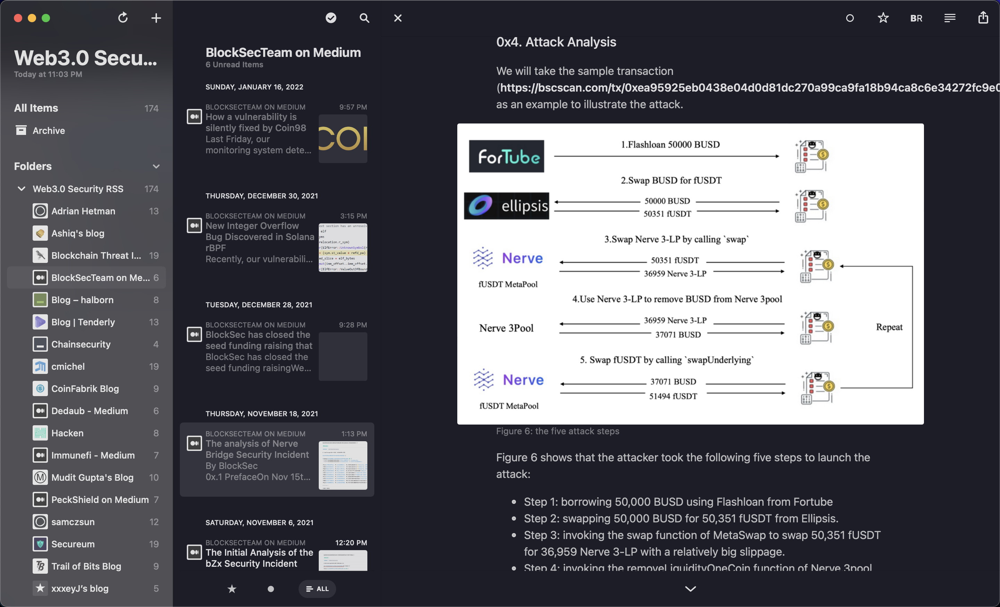

# Web3.0 Security RSS
Introduction: RSS subscriptions related to Web3.0 Security, helping to establish personal intelligence sources and daily knowledge base updates.

## Reeder5 (macOS, iOS)

import OMPL into Reeder: Subcsriptions -> Add subscription -> Import form OPML.

*If you have any high-quality website feeds, please submit a PR or issue*
